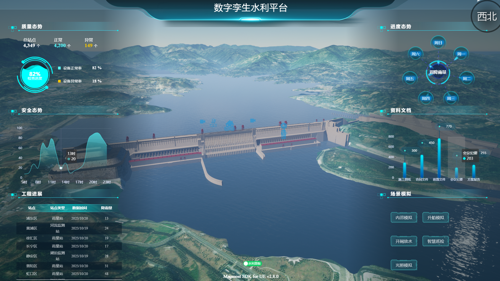
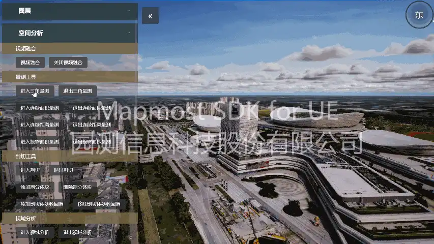
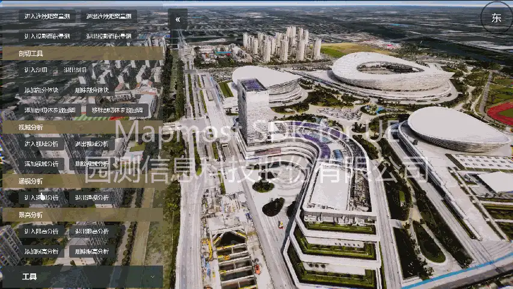
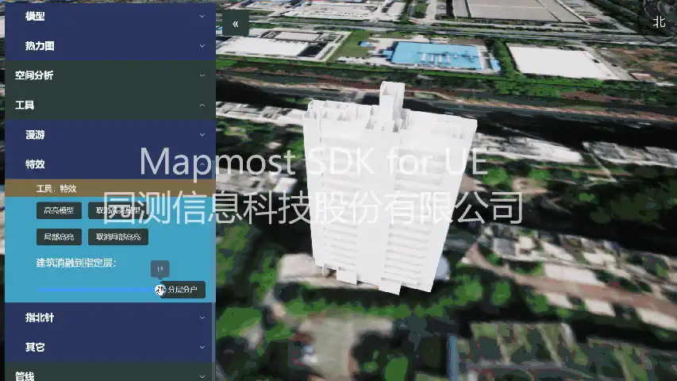

# 简介  
本项目为基于Mapmost SDK for UE开发的水利数字孪生示例工程，并包含了SDK的全量接口调用示例。旨在帮助大家了解该SDK的核心用法，以及如何通过SDK实现一定规模的数字孪生应用。

## Mapmost SDK for UE

  [Mapmost SDK for UE](https://www.mapmost.com/#/layout/ue/home/) 是 [Mapmost 系列](https://www.mapmost.com/) 的重要部分，是一个 UE5的插件，它提供了一系列可通过JavaScript 调用的接口。

  - Mapmost SDK for UE数字孪生底座是面向城市数字孪生应用场景的开发工具，通过组合底座提供的数据治理、地理人工智能计算、时空分析、可视化分析、场景交互、图层管理等能力，能够快速实现面向数字孪生城市、数字孪生城管、数字孪生交通、数字孪生轨交、数字孪生警务等方向的三维仿真场景搭建，赋能城市全域管理及智能化决策。

  - 开始使用 Mapmost SDK for UE，请注册 [Mapmost 账户](https://www.mapmost.com/#/productApply/ue)。

  - 水利数字孪生[示例视频](https://www.bilibili.com/video/BV1P94y137kA/)
  - 水利数字孪生[示例工程下载](https://www.mapmost.com/mapmost_docs/UE/latest/docs/quickStart/shuiliDemo/)
  - Mapmost SDK for UE [插件下载](https://www.mapmost.com/mapmost_docs/UE/latest/docs/quickStart/getPlugin)
  - 产品使用 [快速开始](https://www.mapmost.com/mapmost_docs/UE/latest/docs/category/%E5%BF%AB%E9%80%9F%E5%BC%80%E5%A7%8B)

  

------
### 能力
| 数据加载       | 场景交互  | 点线面特效    | 图层管理          | 空间专题图 |
| -------------- |-------|----------|---------------| ---------------- |
| ✓ 加载影像地图服务 | ✓ 地图控制 | ✓ Marker | ✓ 图层显示与隐藏     | ✓ 区域热力专题图 |
| ✓ 加载倾斜三维模型服务 | ✓ 路径漫游 | ✓ 多段线    | ✓ 添加/删除POI图层  |  |
| ✓ 加载手工模型 | ✓鼠标点选 | ✓ 围栏特效   | ✓ POI避让       |  |
| ✓ 加载三维管线模型 |       | ✓ 扩散特效   | ✓ 添加/删除三维对象图层 |  |
| ✓ 加载GeoJson数据 |       | ✓ 飞线特效   | ✓ 添加道路注记      |  | |
|  |       |          | ✓ 道路注记避让      ||
|  |       |          |               ||

 

| 视频播放         | 视频融合       | 视域分析           | 通视分析   | 限高分析   |
|--------------| -------------- | ------------------ |--------|--------|
| ✓ 场景内MP4视频播放 | ✓ 投影视频融合 | ✓ 静态传参视域分析 | ✓ 动态交互通视分析 | ✓ 静态传参限高分析 |
| ✓ 场景内RTSP视频播放 |                | ✓ 动态交互视域分析 |   | ✓ 动态交互限高分析 |
| ✓ 页端HLS视频流播放 |                |                    |        |  |  |
| ✓ 页端MP4视频播放  |                |                    |        |  |  |

 

| 量测       | 剖分     | 管线       | 设置                     |
|----------| -------- |----------| ------------------------ |
| ✓ 三角量测   | ✓ 体剖分 | ✓ 管线点选   | ✓ 设置UI网页URL          |
| ✓ 连续距离量测 |  | ✓ 管线高亮   | ✓ 设置倾斜摄影服务URL    |
| ✓ 连续面积量测 |          | ✓ 管线横纵截面分析 | ✓ 设置地形服务URL        |
| ✓ 投影面积量测 |          | ✓ 管线流向分析 | ✓ 设置影像服务URL        |
 |          |          | ✓ 管线连通分析 | ✓ 设置相机初始位置及姿态 |

------
### 接口分类
<table>
<thead>
    <tr>
        <th>接口大类</th>
        <th>接口小类</th>
    </tr>
</thead>
<tbody>
    <tr>
        <td rowSpan="3">相机</td>
        <td>相机交互</td>
    </tr>
    <tr>
        <td>相机控制</td>
    </tr>
    <tr>
        <td>相机事件</td>
    </tr>
    <tr>
        <td rowSpan="12">图层</td>
        <td>3DTiles：加载/删除</td>
    </tr>
    <tr>
        <td>TMS：加载/删除</td>
    </tr>
    <tr>
        <td>WMS：加载/删除</td>
    </tr>
    <tr>
        <td>WMTS：加载/删除</td>
    </tr>
    <tr>
        <td>POI：添加/删除、可见性控制、高亮、更新、点击监听、展开状态监听</td>
    </tr>
    <tr>
        <td>热力图：添加/删除</td>
    </tr>
    <tr>
        <td>Marker：添加/删除、可见性控制、更新、点击监听</td>
    </tr>
    <tr>
        <td>点位扩散效果：添加/删除</td>
    </tr>
    <tr>
        <td>动态线：添加/删除</td>
    </tr>
    <tr>
        <td>飞线：添加/删除</td>
    </tr>
    <tr>
        <td>GeoJson：添加/删除/更新，包括面和地理围栏</td>
    </tr>
    <tr>
        <td>注记：添加/删除、开启/关闭注记避让</td>
    </tr>
    <tr>
        <td rowSpan="6">空间分析</td>
        <td>视频融合：添加/删除</td>
    </tr>
    <tr>
        <td>空间量测：三角距离量测、连续距离量测、连续面积量测、投影面积量测</td>
    </tr>
    <tr>
        <td>空间剖分：进入/退出剖分状态、添加/删除剖分体</td>
    </tr>
    <tr>
        <td>视域分析：进入/退出状态、添加/删除视域分析</td>
    </tr>
    <tr>
        <td>通视分析：进入/退出通视分析状态</td>
    </tr>
    <tr>
        <td>限高分析：进入/退出状态、添加删除限高分析</td>
    </tr>
    <tr>
        <td rowSpan="2">工具</td>
        <td>漫游：开始/暂停/继续/停止、漫游监听</td>
    </tr>
    <tr>
        <td>其它工具类接口</td>
    </tr>
    <tr>
        <td rowSpan="6">管线</td>
        <td>管线基本操作：加载/卸载、可见性、点选事件、高亮</td>
    </tr>
    <tr>
        <td>管线分析：联通性分析、流向分析、横截面分析、纵截面分析</td>
    </tr>
</tbody>
</table>

------

## 示例

- 示例正在持续更新中，想要了解更多请参考 [接口文档](https://www.mapmost.com/mapmost_docs/UE/latest/docs/api/Camera)。

|三角量测|通视分析|建筑消融
|---------|-----------------------|-----------------------
|||

### License
The MIT License.